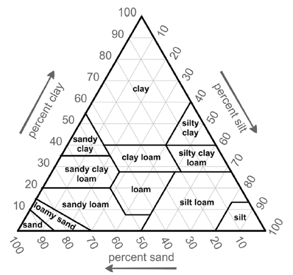
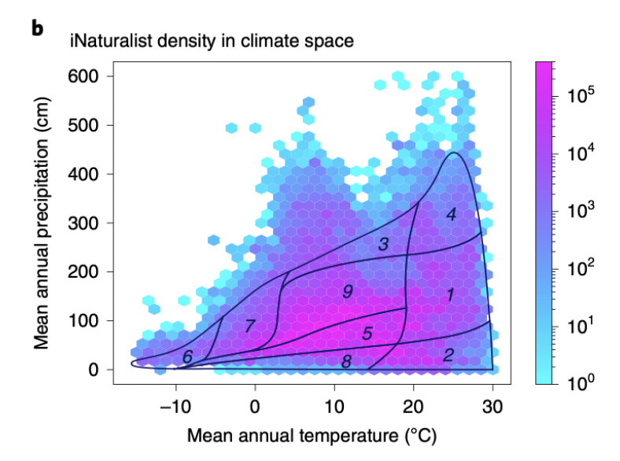
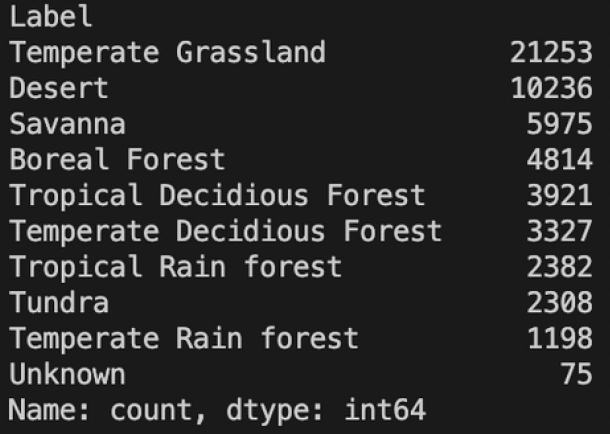
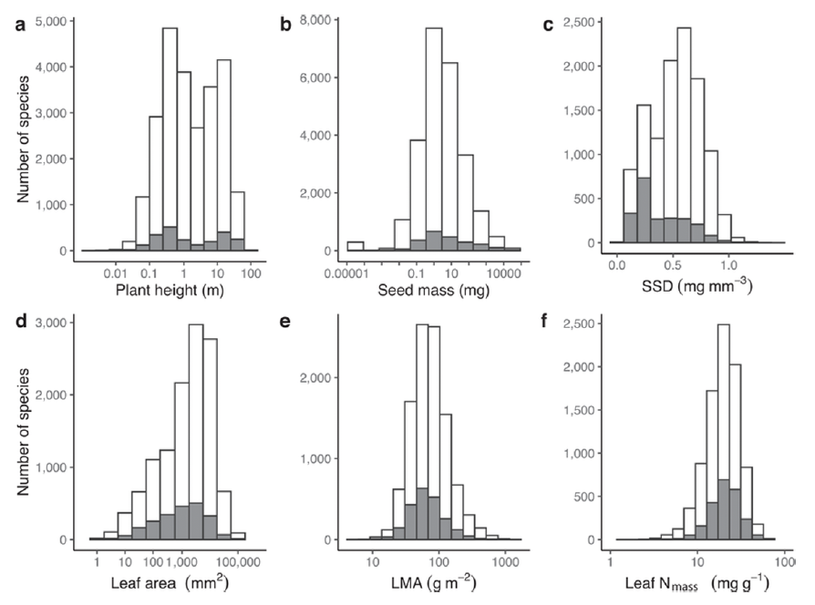
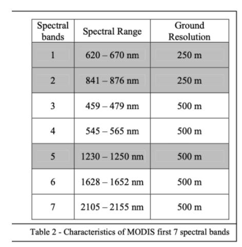
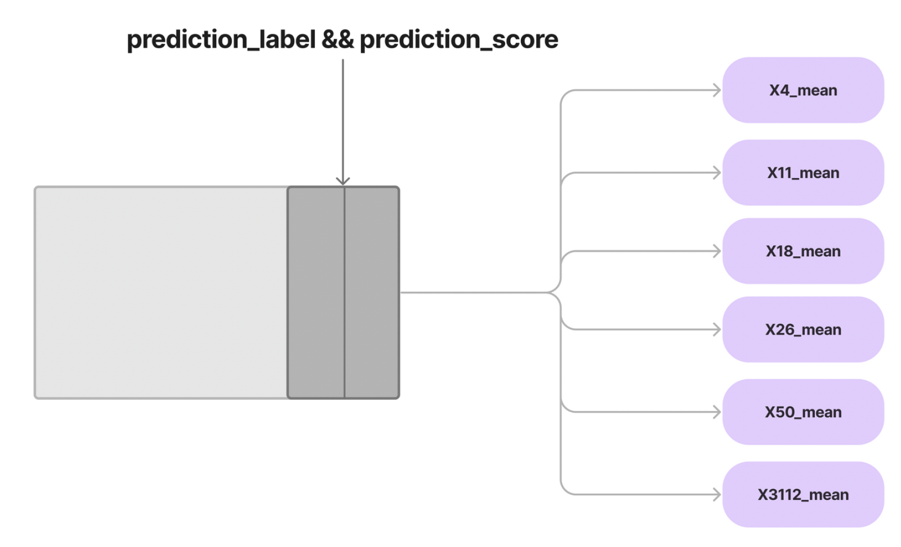
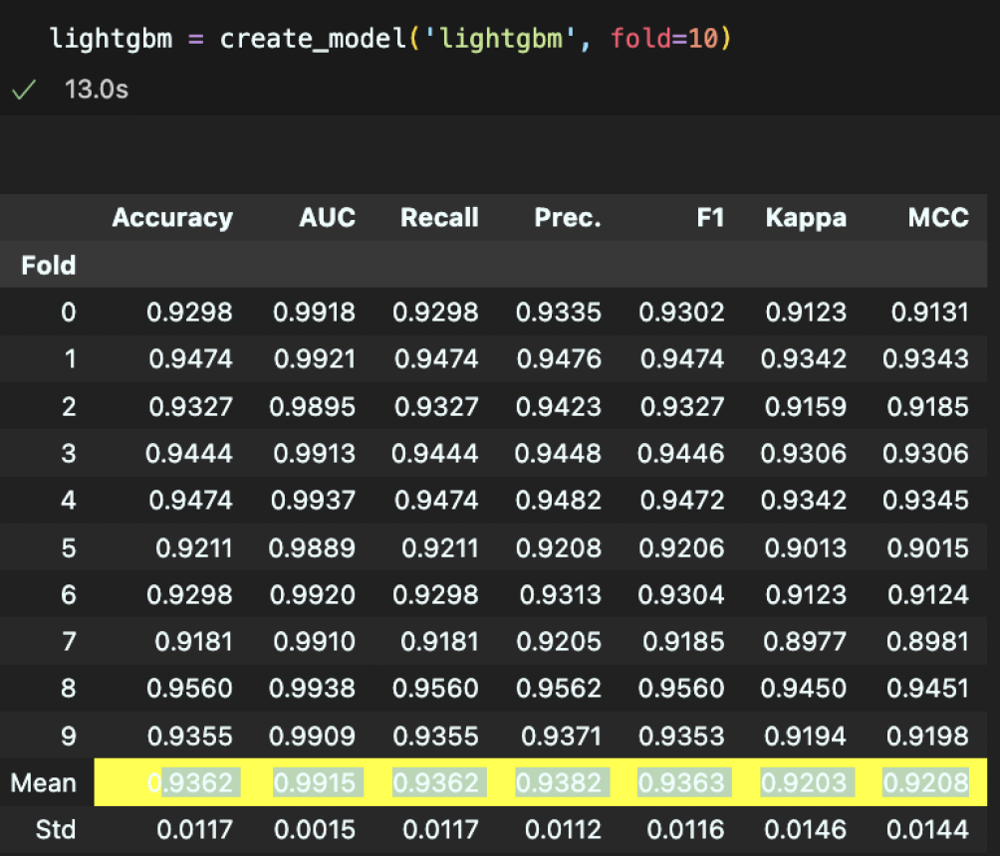
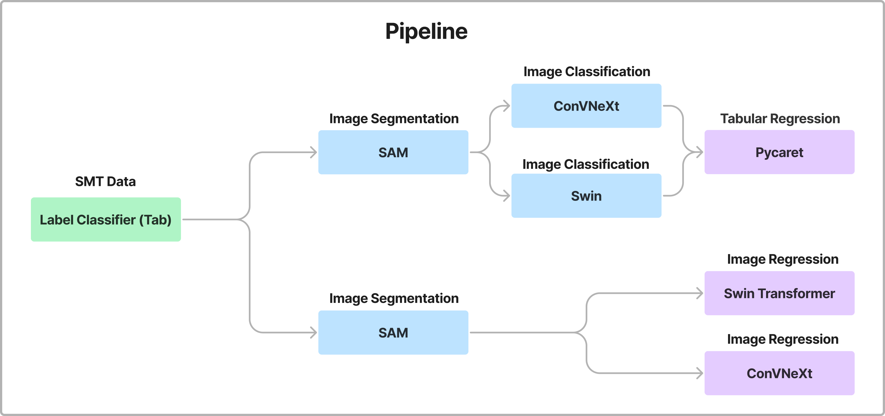

# Kaggle PlantTraits2024 Competition 

## Overview

### Goal:

The goal of this project is to predict a broad set of six key plant traits (e.g., leaf area, plant height) using crowd-sourced plant images and ancillary tabular data.

### Importance:

Plants are the superheroes of our ecosystems. Their traits help us understand ecosystem diversity, productivity, and resilience to challenges such as climate change. By participating in this project, you contribute to a better understanding of how plants navigate the complexities of changing climates, enriching the knowledge of our ecosystems.

### Motivation:

Using thousands of plant images captured by citizen scientists, this project allows us to analyze critical plant traits and explore the factors affecting ecosystems. It’s an opportunity to become a part of a larger mission aimed at improving our understanding of nature.

---

## Problem

- **Image Quality**: Many of the crowd-sourced images vary significantly in quality, angle, resolution, and focus.
- **Tabular Data Quality**: The tabular data presents a challenge due to its reliance on geographical information, specifically the latitude and longitude where each plant was found. Various environmental and climatic characteristics tied to these coordinates were used as input variables. However, there is no guarantee that these location-based features are directly related to the six plant traits we aim to predict, making the connection between the input data and target traits uncertain.

---

## Approach

### 1. **Tabular Data Utilization**

### **Key Variable Selection**:

The tabular data is divided into four main categories: soil, climate, MODIS, and VOD variables. Here's a detailed breakdown:

- **Soil Variables**:
    - We focus on the key soil texture variables: CLAY, SILT, and SAND. To enhance interpretability, we categorized these using the **USDA Soil Texture Triangle**, classifying them into 13 distinct texture types based on their relative proportions. This approach allows us to capture soil characteristics more effectively in relation to plant traits.
        
            
- **Climate and Precipitation**:
    - For the climate variables, we applied **Whittaker’s Biome Classification** to categorize different climate zones. Using mean annual temperature and precipitation values, we classified the data into nine distinct biome categories (e.g., temperate, tropical, polar, etc.).
        
    

    
        
- **Specific Leaf Area (SSD)**:
    - Unlike other traits such as Plant Height and Seed Mass, SSD (Specific Stem Density) showed a distinct distribution pattern. We used domain knowledge and methods such as EM-Method and K-means clustering to classify woody/non-woody species based on SSD.
        
    
        
- **MODIS & VOD Time Series**:
    - We used a TorchCoder-based LSTM Autoencoder to embed the time-series data (2000–2020 monthly averages for each wavelength) into a more manageable format, reducing 96 columns into eight essential features.
        
    
        

### **SMT Data (Species Metadata)**:

- We utilized the iNaturalist database as the source for original species classification, enabling us to merge original TRY Dataset species data with the Kaggle dataset for better species categorization.
    
    
    
- **Species Classification Logic**:
    - Using domain knowledge, we classified species based on factors such as Woodiness, Growth Form, and Phylogenetic Group. Clustering patterns were observed and labels grouped accordingly.
- **Classification Modeling**:
    - We applied machine learning models to predict species classifications and compared accuracy based on these criteria. Various resampling techniques (e.g., oversampling and undersampling) were employed to manage class imbalance.

### **Model Training and Inference**:

- We trained a LightGBM classification model to predict species using six traits as features. The final model achieved an accuracy of ~0.95. We then used this model’s predicted labels and scores as input features for predicting plant traits.
    
    

    
    

### 2. **Image Processing and Modeling**

### **Image Preprocessing**:

- We used SAM (Segment Anything Model) to segment the plants in the images. However, due to the variability in image quality and difficulty in segmenting objects with unclear boundaries, we opted to use cropped images for the modeling.

### **Image Regression**:

- To predict the six plant traits from images directly, we trained Swin Transformer V2 and ConvNeXt models on the cropped plant images. These models were tasked with learning the visual representations needed to predict the traits.

---

## Pipeline

### 1. **Tabular Regression**:

- For the test set, where species classification was unavailable, we designed a classifier based on the tabular data. This classifier, which combines predictions from **ConvNeXt** and **Swin Transformer** for images and **PyCaret** for tabular data, was used to generate species labels and confidence scores.
- We focused on training samples with a species classification confidence score higher than 0.9 to ensure the model learned representative plant characteristics.

### 2. **Image Regression**:

- In parallel, we conducted image-based regression where the model directly predicted plant traits from images without relying on pre-classified species. Using Swin V2 and ConvNeXt backbones, the model predicted the six target traits based on the plant image's visual features.

---

## Final Results

- The final model efficiently predicted six critical plant traits by combining both image and tabular data through species classification and direct image regression.
    
    